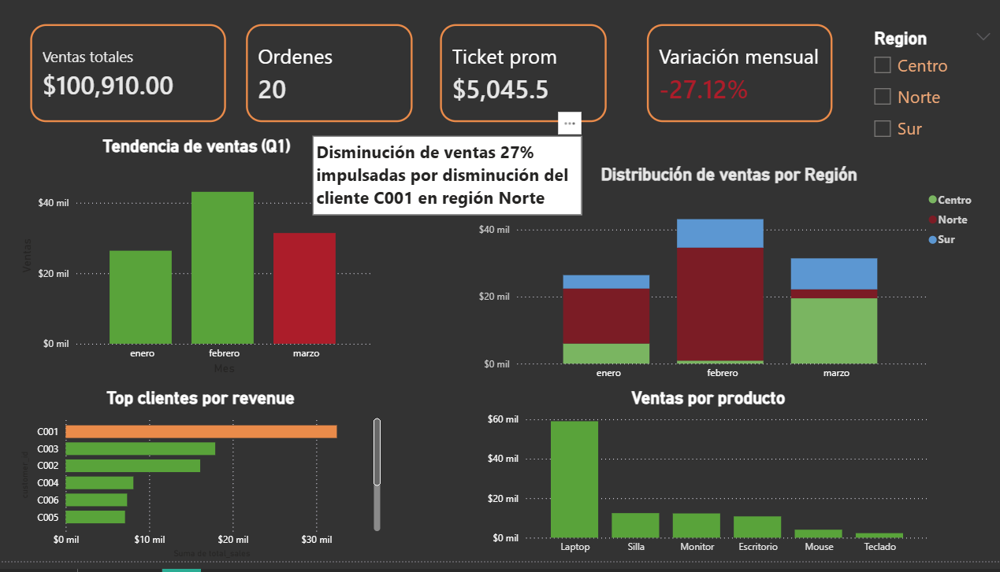

## Business Problem

In March, sales dropped by 27%, impacting overall performance.	

## Objective:

Identify the root cause of the decline and assess business risk.

## Tools Used

SQL (data extraction \& transformation)

Power BI (data visualization)

Excel (data cleaning)

## Key Findings

The business showed a high dependency on client C001, especially in the North region.

## Risk Identified

Revenue concentration created a structural vulnerability.

## Business Insights

Revenue concentration creates vulnerability

A single client can heavily impact performance

Need for diversification strategy in the North región

## Recommendations

Reduce dependency on top clients
Diversify customer base
Monitor client activity trends

##  Dashboard Preview

